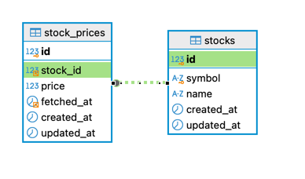
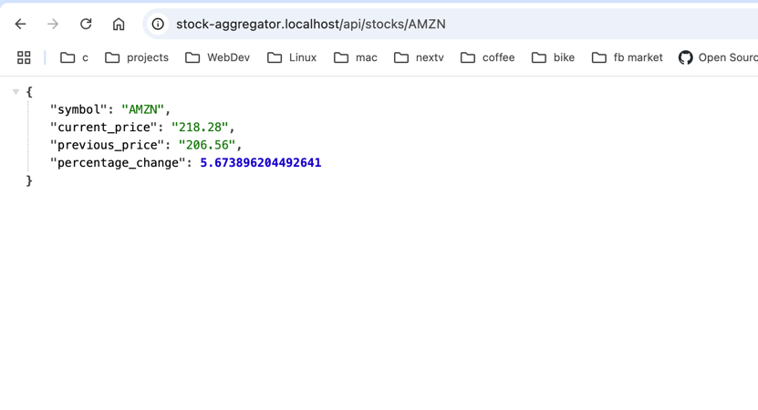
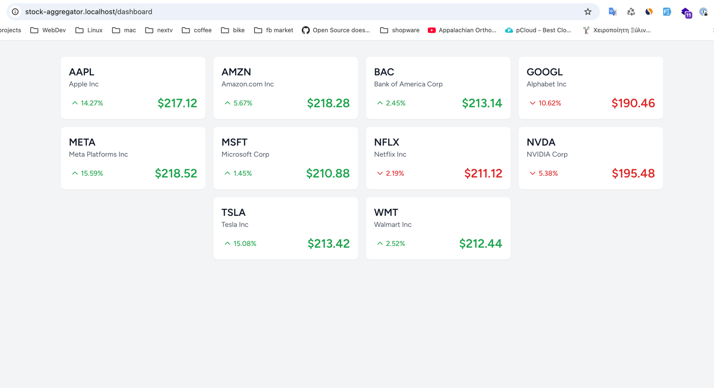

# Building a Real-time Stock Price Aggregator

### Hey there,

I do not go into details here as they are mentioned in the PDF.

First of all, you need the following services running on your local/server environment:
1. PHP >= 8.2 with the PHP extensions required by Laravel 11 (see: [Laravel Server Requirements](https://laravel.com/docs/11.x/deployment#server-requirements))
2. MySQL/MariaDB
3. Redis
4. node & npm to build the assets and be able to view the dashboard. Thanks to vite the build process is superfast ;)

In my daily routine I use my own php containerized environment https://github.com/panakour/phpdock which let me have multiple php versions at the same time with nginx and php-fpm.

In the end for this project for simplicity if I have the time, I will create a docker and docker compose specifically for this project.

### Steps to run this project

- Copy [.env.example](.env.example) to .env
    - Modify the APP_URL to your own
    - I have already predefined some default settings, such as Redis options
    - Install dependencies `composer install`
    - Generate APP_KEY `php artisan key:generate`
    - Configure your DB credentials and Redis
    - Configure the Alpha Vantage API key: ALPHA_VANTAGE_API_KEY
    - Run migrations using `php artisan migrate`
    - Seed the stock items using `php artisan db:seed StockSeeder`
    - `npm install && npm run build`
    - Run the Scheduler `php artisan schedule:work`
    - Run the job to fetch prices from Alpha Vantage API `php artisan queue:work`
    - or the fake fetcher using the command `php artisan app:fetch-fake-prices`

...and you are ready to go.


### More details about fetching of stock price data
To start fetching prices, you should have a supervisor for your job processing or run `php artisan queue:work`.  
In the scheduler, I have registered a job that runs every minute.  
This scheduled job calls the AlphaVantage API to get the latest prices for my 10 chosen seeded stock items.

Because I ran into trouble with the AlphaVantage API limit (Thank you for using Alpha Vantage! Our standard API rate limit is 25 requests per day. Please subscribe to any of the premium plans), I refactored the [FetchStockPrice.php](app/Jobs/FetchStockPrice.php) job to not depend on the AlphaVantage concrete class directly but on the [Fetcher.php](app/Fetchers/Fetcher.php) interface.
Doing so I was able to implement another fetcher `FakeFetcher` that returns a random number. This is let me proceed and test the app without being blocked by the API limit.  
One important part here is that now is easy to swap to any price fetcher (not only the AlphaVantageFetcher) without modifying the internal logic.

After each fetch operation, I cache the data (see [FetchStockPrice.php](https://github.com/panakour/stock-aggregator/blob/main/app/Jobs/FetchStockPrice.php#L58))
to ensure end users get the fastest possible response when using the endpoints and dashboard.
I'm using Redis for caching to make the application scalable and efficient under high load.

I've implemented the caching layer in a standalone class [StockCache.php](app/Services/StockCache.php) to make it fully testable and ensure the application's accuracy. This separation of concerns allows for better testing reusability and maintenance of the caching logic.
I did the same as well for [PercentageChangeCalculator.php](app/Services/PercentageChangeCalculator.php)

#### Database Structure


The application uses two tables:
- `stocks`: Stores the basic stock information (symbol and name)
- `stock_prices`: Records price history with timestamps
    - Each price record is linked to a stock via `stock_id`
    - Includes `fetched_at` timestamp to track when each price was obtained

The relationship between these tables allows us to track historical price data for each stock.


If you want to use the fake fetcher, run `php artisan app:fetch-fake-prices`. Since it dispatches the same queue job, you should also have a running worker.

After you have some pricing data, you can explore what is implemented.

You can view two endpoints: `/api/stocks` and `/api/stocks/{symbol}` which return JSON.

Keep in mind the images below dot not have accurate prices data, as the prices are fetched using the fake fetcher.  
The first endpoint returns a list of stock items, cached indefinitely (Look at the Cache::forever in [StockSeeder.php](database/seeders/StockSeeder.php)) since no changes are needed:  


The second endpoint takes a symbol and returns the latest price, percentage change, and the previous price:  


By visiting `/dashboard`, you can see a minimal, visually appealing list of stocks, with color-coded arrows showing positive or negative changes. This gives an immediate understanding of how the app works.  
This page uses Alpine.js, and I have also added an interval that updates automatically every 60 seconds, so you do not need to refresh the browser:  
`setInterval(() => this.fetchPrice(), 60000);`


***Notes:*** Initially, I developed this project using PHP 8.4 since I always like to use the latest versions. However, I faced some issues using Laravel Pint, so I switched to PHP 8.3.

#### Other tools I have installed and configured:
- phpstan with Larastan for code analysis
- Horizon for troubleshooting and observing the queues (access it at `/horizon`)

Some useful commands (ideally run in CI/CD) to ensure code quality and as less bug as possible before deployment:
- To run tests: `php artisan test`
- To run phpstan: `composer analyse`
  

I am also using Laravel Pint for linting, which you can run with `composer lint`.


## Docker
I have created a fully containerized environment to be able this project with all the needed services

#### steps for up and running
```shel
docker compose up -d
docker compose exec php composer install
docker compose exec php php artisan key:generate
docker compose exec php php artisan migrate
docker compose exec php php artisan db:seed StockSeeder
```

To run the test use the cmd `docker compose exec php php artisan test` and for phpstan `docker compose exec php composer analyse`

#### Data fetching:
In the docker a Supervisor was configured to execute the queue service worker, so if you have Alpha Vantage API configured is going to start automatically to fetch prices from there every minute.

otherwise execute the faker 2-3 or more times to get some prices in the history just for demonstration.
```shel
docker compose exec php php artisan app:fetch-fake-prices
docker compose exec php php artisan app:fetch-fake-prices
docker compose exec php php artisan app:fetch-fake-prices
```

#### View web app
The listened port for this container is the 8080. 

The available urls you can access:
- http://localhost:8080/api/stocks
- http://localhost:8080/api/stocks/{symbol}
- http://localhost:8080/dashboard

#### for troubleshooting you can have a look at the bellow logs:
- [queue-worker.log](storage/logs/queue-worker.log)
- [cron.log](storage/logs/cron.log)
- [laravel.log](storage/logs/laravel.log)

also you can view the laravel horizon at http://localhost:8080/horizon
