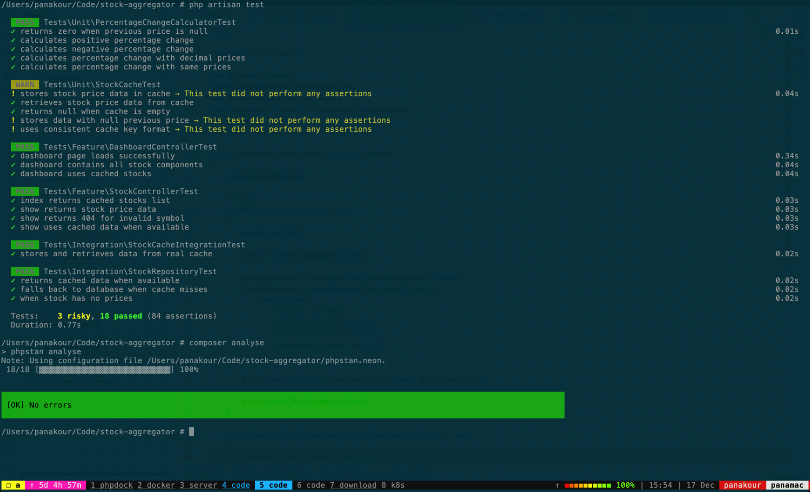

# Building a Real-time Stock Price Aggregator

### Hey there,

I do not go into details here as they are mentioned in the PDF.

First of all, you need the following services running on your local/server environment:
1. PHP >= 8.2 with the PHP extensions required by Laravel 11 (see: [Laravel Server Requirements](https://laravel.com/docs/11.x/deployment#server-requirements))
2. MySQL/MariaDB
3. Redis

In my every day routine I use my own php contenirize env https://github.com/panakour/phpdock which let me have multiple php versions at the same time with nginx and php-fpm.

In the end for this project for simplicity, I will create a docker and docker compose specificaly for this project if you want.

### Steps to run this project

- Copy [.env.example](.env.example) to .env
    - Modify the APP_URL to your own
    - I have already predefined some default settings, such as Redis options
    - Install dependencies `composer install`
    - Generate APP_KEY `php artisan key:generate`
    - Configure your DB credentials and Redis
    - Configure the Alpha Vantage API key: ALPHA_VANTAGE_API_KEY
    - Run migrations using `php artisan migrate`
    - Seed the stock items using `php artisan db:seed StockSeeder`
    - `npm install && npm run build`
    - Run the Scheduler `php artisan schedule:work`
    - Run the job to fetch prices from Alpha Vantage API `php artisan queue:work`

...and you are ready to go.

### More details about fetching of stock price data
To start fetching prices, you should have a supervisor for your job processing or run `php artisan queue:work`.  
In the scheduler, I have registered a job that runs every minute.  
This scheduled job calls the AlphaVantage API to get the latest prices for all 10 seeded stock items.

Because I ran into trouble with the AlphaVantage API limit (up to 25 requests per day), I refactored the `FetchStockPrice` job to not depend on the AlphaVantage class directly but on a `Fetcher` interface. I also implemented a `FakeFetcher` that returns a random number, allowing me to proceed without being blocked by the API limit.  
With this change, it is now easy to swap in any price fetcher (not only the AlphaVantageFetcher) without modifying the internal job processing logic.

If you want to use the fake fetcher, run `php artisan app:fetch-fake-prices`. Since it dispatches the same queue job, you should also have a running worker.

After you have some pricing data, you can explore what is implemented.

You can view two endpoints: `/api/stocks` and `/api/stocks/{symbol}` which return JSON.

Keep in mind the images below might not reflect accurate data, as the prices may come from the fake fetcher.  
The first endpoint returns a list of stock items, cached indefinitely since no changes are needed:  

The second endpoint takes a symbol and returns the latest price, percentage change, and the previous price:  

By visiting `/dashboard`, you can see a minimal, visually appealing list of stocks, with color-coded arrows showing positive or negative changes. This gives an immediate understanding of how the app works.  
This page uses Alpine.js, and I have also added an interval that updates automatically every 60 seconds, so you do not need to refresh the browser:  
`setInterval(() => this.fetchPrice(), 60000);`

***Notes:*** Initially, I developed this project using PHP 8.4 since I like the latest versions. However, I faced some issues using Laravel Pint, so I switched to PHP 8.3.

#### Other tools I have installed and configured:
- phpstan with Larastan for code analysis
- Horizon for troubleshooting and observing the queues (access it at `/horizon`)

Some useful commands (ideally run in CI/CD) to ensure code quality and as less bug ass possible before deployment:
- To run tests: `php artisan test`
- To run phpstan: `composer analyse`
  

I am also using Laravel Pint for linting, which you can run with `composer lint`.
